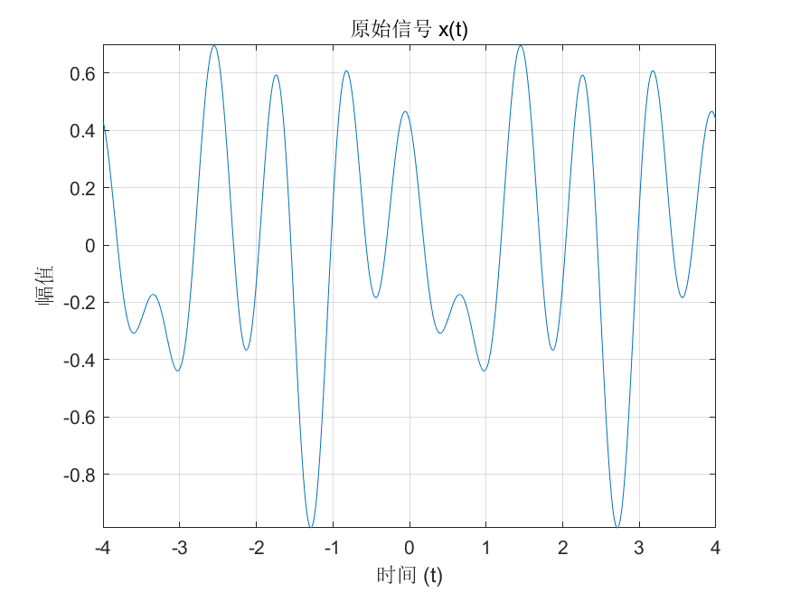
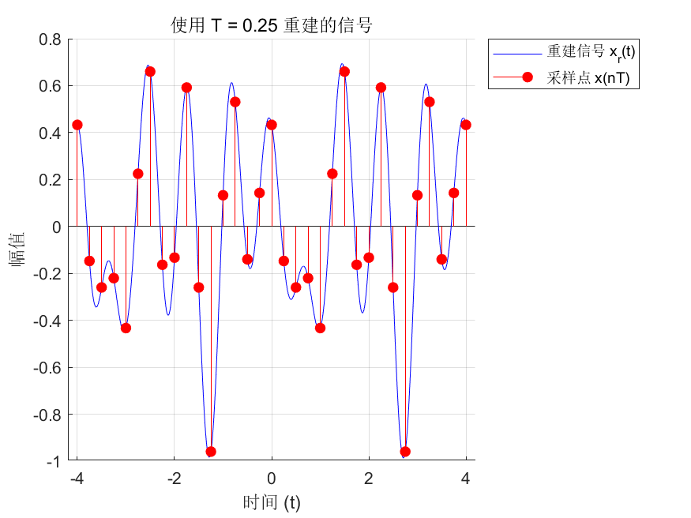
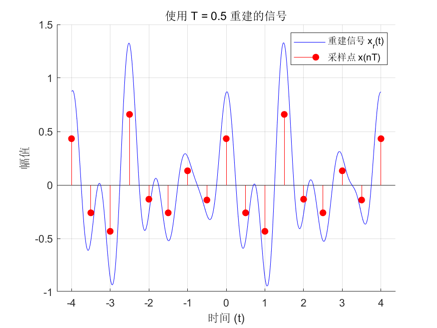
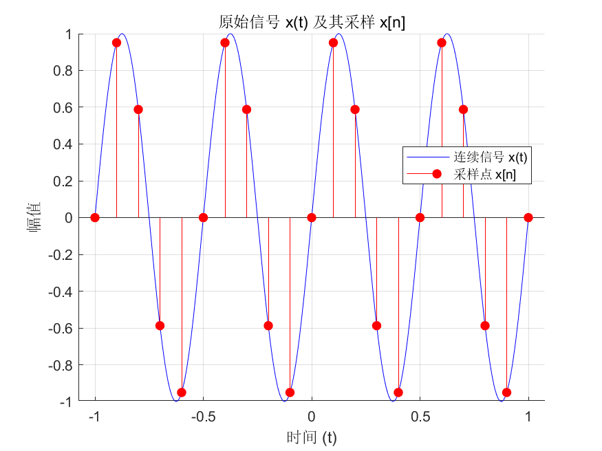
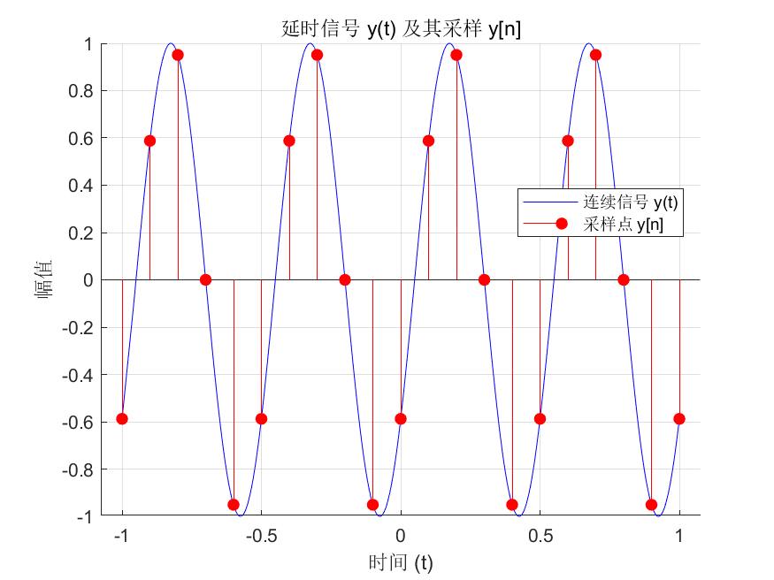
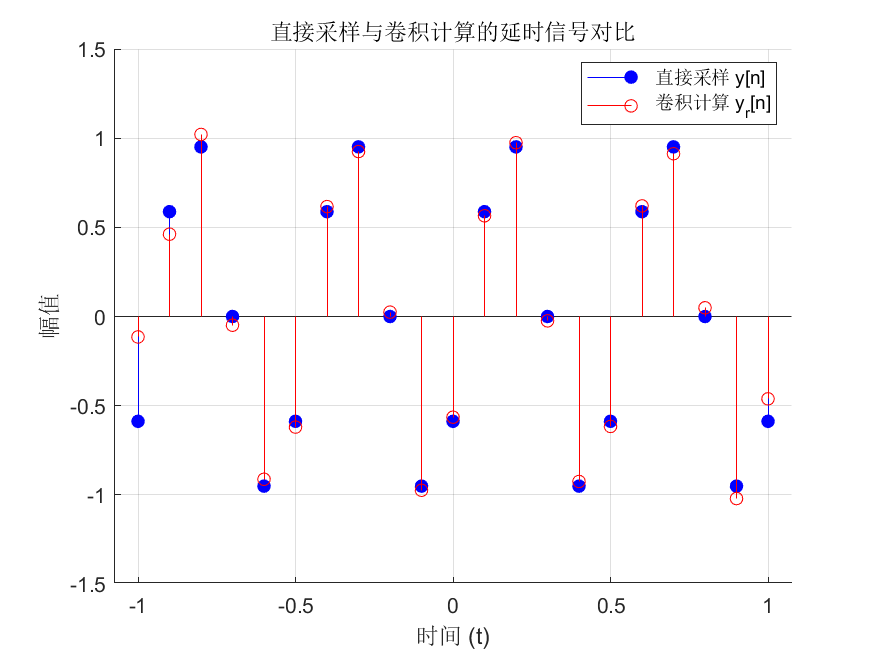
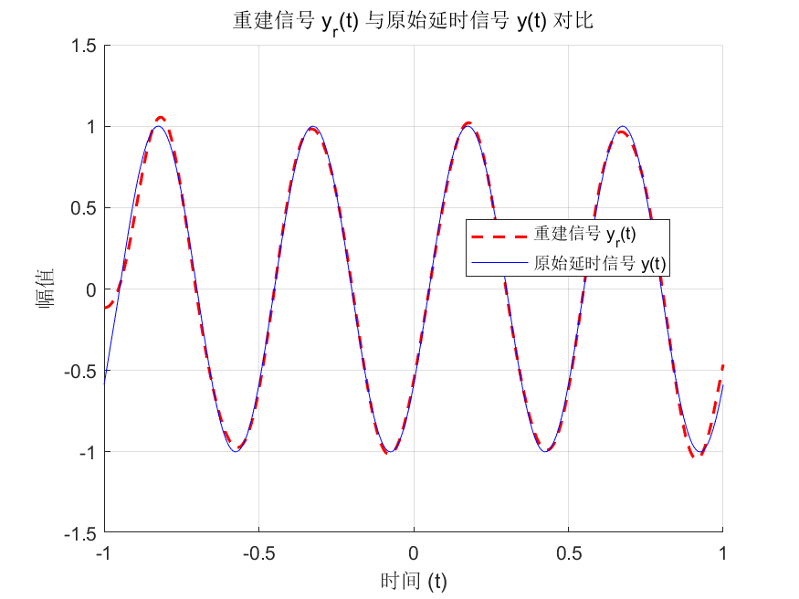

# 第一题
1.用带限内插公式重建信号。若
xt=0.3sin(2πt)+0.4cos(2.5πt+π/4)+0.3cos(πt+π/3)
(1)计算xt的奈奎斯特采样频率。(2ωm=5π)
(2)画出xt在区间[-4,4]的波形。
(3)画出以采样周期T=0.25时基于离散信号xn=x(nT)并利用带限内插公式重建的波形。
(4)画出以采样周期T=0.5时基于离散信号xn=x(nT)并利用带限内插公式重建的波形。

(1)
$\omega_s = 2 \times 2.5 \pi = 5 \pi$

(2)
波形如下图所示


(3) 和 (4) 的采建波形如下图所示



可以看到(3)的重建波形更接近原始信号，而(4)的重建波形出现了明显的失真。这是因为采样周期T=0.5对应的采样频率低于奈奎斯特频率，导致了混叠现象的发生。采样周期最大值为0.4，超过这个值就会出现混叠现象。

# 第二题
已知连续延时器的系统函数 \( h(t) \) 及其频谱 \( H(j\omega) \)：
\[
h(t) = \delta(t - t_0) \;\longrightarrow\; H(j\omega) = e^{-j\omega t_0}
\]
系统满足采样定理，采样周期为 \( T \)，则有：
\[
H(j\omega) = 
\begin{cases} 
e^{-j\omega t_0}, & \omega \in \left( -\dfrac{\pi}{T}, \dfrac{\pi}{T} \right) \\[1em]
0, & \text{其他}
\end{cases}
\]
因此：
\[
H_d(e^{j\omega}) = H\!\left(j\frac{\omega}{T}\right) = e^{-j\omega \frac{t_0}{T}}, \quad \omega \in (-\pi, \pi)
\]

对连续信号 \( x(t) = \sin(4\pi t) \) 进行 \( \dfrac{T}{2} \) 延时：
\[
y(t) = x\!\left(t - \frac{T}{2}\right) = \sin\!\left[4\pi\left(t - \frac{T}{2}\right)\right]
\]


(1)以 \( T = 0.1 \) 对 \( x(t) \) 采样得 \( x[n] = x(nT) \)，画出 \( x(t) \) 和 \( x[n] \) 的图像。

(2)以 \( T = 0.1 \) 对 \( y(t) \) 采样得 \( y[n] = y(nT) \)，画出 \( y(t) \) 和 \( y[n] \) 的图像。

(3)利用公式 (5.60) 中的 \( h_d[n] = sinc(n-f_s t_0) \) 计算 \( x(t) \) 延时的采样值：
\[
y_r[n] = x[n] * h_d[n]
\]

(4)利用带限信号的低通内插，从 \( y_r[n] \) 中恢复 \( y_r(t) \)。画出 \( y_r[n] \) 和 \( y_r(t) \) 的图像。并比较 \( y_r(t) \) 与 \( y(t) \) 图像的一致性。

(1) 和 (2) 的图像如下所示



(3) 和 (4) 的图像如下所示   


可以看到重建基本成功，但是边界点误差较大。以下为原因分析
 
 ---
 
第3小问：y[n] ≠ yr[n] 的原因                                             
                                                                    
  理想分数延迟滤波器被截断
                                                                    
  理论上，对 x[n] 施加分数延迟 d = 0.5 的滤波器为：

  $$h_d[n] = \text{sinc}(n - 0.5), \quad n \in (-\infty, +\infty)$$

  该滤波器支撑长度无限，代码中却截断到 n_hd = -20:20（共41个系数）。

  关键问题在于 sinc 函数在 d = 0.5 时衰减极慢：

  $$\text{sinc}(n - 0.5)\big|_{n=20} = \frac{\sin(19.5\pi)}{19.5\pi} =
  \frac{1}{19.5\pi} \approx 0.016$$

  边界处的系数约为
  1.6%，累加起来对卷积结果产生可见偏差。这是截断误差，不是零。

  此外，卷积两端的边界效应：当 xn 中边缘的 x[n] 与 hd 做卷积时，序列两端的
  x[n] "看不到"窗口外的样本，等价于窗口外补零，也引入误差。

  第4小问：yr(t) ≠ y(t) 的原因

  有两层误差叠加：

  1. yr[n] 本身有误差（从第3问传播）

  yr[n] ≠ y[n]，所以以 yr[n] 为系数做 sinc 内插，重建出的 yr(t) 自然与 y(t)
   有偏差。

  2. sinc 重建的有限求和截断

  代码中的重建公式（第107-109行）：

  for i = 1:length(n)
      yrt = yrt + yr(i) * sinc(2*fc*(t - n(i)*T));
  end

  理想 sinc 内插公式要求无穷求和：

  $$y_r(t) = \sum_{n=-\infty}^{+\infty} y_r[n] \cdot
  \text{sinc}\left(\frac{t - nT}{T}\right)$$

  而代码只对 n = -10, -9, …, 10 共 21 个样本求和。在 t 接近区间边界（t →
  ±1）时，窗口外样本的 sinc
  贡献被完全丢弃，导致重建在区间两端误差较大，中间较好。

  ---


| 问题 | 主要原因 |
| :--- | :--- |
| y[n] ≠ yr[n] | hd[n] 截断到有限长（±20 taps），sinc 衰减慢，边界系数约 1.6%；加上卷积边界效应 |
| yr(t) ≠ y(t) | ① yr[n] 的误差传播；② sinc 重建只用有限 21 点求和，区间边缘贡献丢失 |

  这两种误差都属于有限长近似带来的截断误差，理论上若 hd
  和重建的求和范围趋于无穷，则 yr[n] → y[n]，yr(t) → y(t)。

# 附录代码
第一题
```matlab
% 提示用户输入日期
date_str = input('请输入日期 (例如 20260528): ', 's');


% 定义符号变量和信号
syms t;
xt = 0.3*sin(2*pi*t) + 0.4*cos(2.5*pi*t + pi/4) + 0.3*cos(pi*t + pi/3);

% (2) 绘制原始信号 xt 在 [-4, 4] 的波形
figure(1);
fplot(xt, [-4, 4]);
title('原始信号 x(t)');
xlabel('时间 (t)');
ylabel('幅值');
grid on;

% 保存图像
saveas(gcf, fullfile('output', ['q12_' date_str '.png']));

% (3) 和 (4) 采样和重建
% 设置采样周期 T
T = 0.5; % 

% 采样
n_min = ceil(-4/T);
n_max = floor(4/T);
n = n_min:n_max;
t_samples = n * T;
xn = subs(xt, t, t_samples);

% 带限内插重建
fc = 2;%滤波截止频率
% 重建信号 xr(t)
xr = 0;
for i = 1:length(n)
    xr = xr + xn(i) * sinc(2*fc*(t - n(i)*T));
end
xr = xr * (2*fc*T);
% 绘制重建信号和采样点
figure(2);
hold on;
fplot(xr, [-4, 4], 'b'); % 绘制重建信号
stem(t_samples, xn, 'r', 'filled'); % 绘制采样点
hold off;

title(['使用 T = ' num2str(T) ' 重建的信号']);
xlabel('时间 (t)');
ylabel('幅值');
legend('重建信号 x_r(t)', '采样点 x(nT)');
grid on;

% 保存图像
saveas(gcf, fullfile('output', ['q13_' date_str '.png']));

```

第二题
```matlab
% problem2.m
% 根据 solution.md 中的第二题要求编写

% 清理工作区和命令窗口
clear; clc; close all;

% --- 基本参数定义 ---
% 提示用户输入日期
date_str = input('请输入日期 (例如 20260528): ', 's');

% 定义符号变量和信号
syms t;
T = 0.1; % 采样周期
xt = sin(4*pi*t); % 原始信号
yt = sin(4*pi*(t - T/2)); % 延时信号

% 定义绘图和采样的时间范围
t_range = [-1, 1];
n_min = ceil(t_range(1)/T);
n_max = floor(t_range(2)/T);
n = n_min:n_max;
t_samples = n * T;

% --- (1) 绘制 x(t) 和采样信号 x[n] ---
figure(1);
hold on;
% 绘制连续信号
fplot(xt, t_range, 'b');
% 计算并绘制采样点
xn = subs(xt, t, t_samples);
stem(t_samples, xn, 'r', 'filled');
hold off;

% 设置图像属性
title('原始信号 x(t) 及其采样 x[n]');
xlabel('时间 (t)');
ylabel('幅值');
legend('连续信号 x(t)', '采样点 x[n]', 'Location', 'best');
grid on;

% 保存图像
saveas(gcf, fullfile('output', ['q21_' date_str '.png']));


% --- (2) 绘制 y(t) 和采样信号 y[n] ---
figure(2);
hold on;
% 绘制连续信号
fplot(yt, t_range, 'b');
% 计算并绘制采样点
yn = subs(yt, t, t_samples);
stem(t_samples, yn, 'r', 'filled');
hold off;

% 设置图像属性
title('延时信号 y(t) 及其采样 y[n]');
xlabel('时间 (t)');
ylabel('幅值');
legend('连续信号 y(t)', '采样点 y[n]', 'Location', 'best');
grid on;

% 保存图像
saveas(gcf, fullfile('output', ['q22_' date_str '.png']));

% --- (3) 计算延时采样值 yr[n] ---
% 根据公式 hd[n] = sinc(n - fs*t0)
fs = 1/T;
t0 = T/2;
d = fs * t0; % 延迟对应的样本数

% 定义 h_d[n] 的计算范围，为了卷积结果准确，范围应足够大
n_hd = -20:20; 
hd = sinc(n_hd - d);

% 计算卷积 yr[n] = x[n] * hd[n]
% 注意：MATLAB的conv函数会使结果序列长度变长
yr_full = conv(double(xn), hd, 'full');

% 为了与 yn 对齐，我们需要截取卷积结果中与 xn 对应的部分
% yr_full(k) 对应时间索引 n_min + n_hd(1) + k - 1
% 要得到 n_min 对应的位置：k = 1 - n_hd(1)
start_index = 1 - n_hd(1);  % = 1 - (-20) = 21
end_index = start_index + length(xn) - 1;
yr = yr_full(start_index:end_index);

% 绘制 yr[n] 和 yn 的对比图
figure(3);
hold on;
stem(t_samples, double(yn), 'b', 'filled', 'DisplayName', '直接采样 y[n]');
stem(t_samples, yr, 'Color', 'r', 'Marker', 'o', 'DisplayName', '卷积计算 y_r[n]');
hold off;

title('直接采样与卷积计算的延时信号对比');
xlabel('时间 (t)');
ylabel('幅值');
legend('Location', 'best');
grid on;

% 保存图像
saveas(gcf, fullfile('output', ['q23_' date_str '.png']));

% --- (4) 从 yr[n] 恢复 yr(t) 并比较 ---
% 使用带限内插公式重建 yr(t)
% 截止频率 fc 应为 fs/2 = 1/(2*T)
fc = 1/(2*T); 
yrt = 0;
for i = 1:length(n)
    yrt = yrt + yr(i) * sinc(2*fc*(t - n(i)*T));
end

% 绘制 yr(t) 和 y(t) 的对比图
figure(4);
hold on;
fplot(yrt, t_range, 'r--', 'LineWidth', 1.5); % 绘制重建信号 yr(t)
fplot(yt, t_range, 'b'); % 绘制原始延时信号 y(t)
hold off;

% 设置图像属性
title('重建信号 y_r(t) 与原始延时信号 y(t) 对比');
xlabel('时间 (t)');
ylabel('幅值');
legend('重建信号 y_r(t)', '原始延时信号 y(t)', 'Location', 'best');
grid on;

% 保存图像
saveas(gcf, fullfile('output', ['q24_' date_str '.png']));
disp('problem2.m 已成功执行，图像已保存到 output 文件夹中。');

```