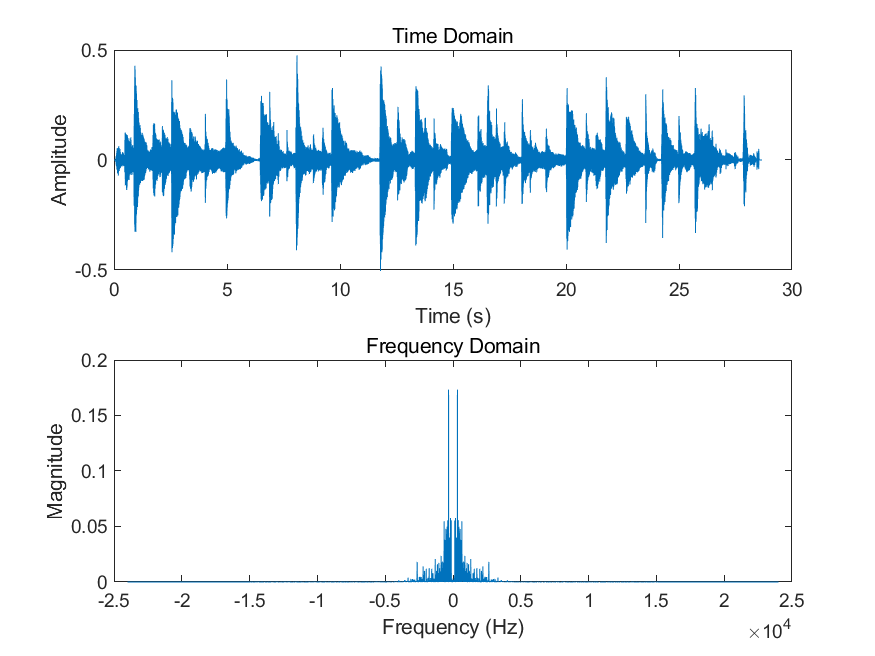

# （1）请录制一段自己的声音，并利用学在浙大第三章程序1打印自己声音的频谱。



我录制了一段钢琴乐曲声音，打印频谱如上。可以看到频谱集中在5kHz以下。
完整代码如下：
```matlab
[x,fs] = audioread('qi.wav');
N = length(x);
t = 0:1/fs:(length(x)-1)/fs;

subplot(2,1,1);
plot(t,x);
title('Time Domain');
xlabel('Time (s)');
ylabel('Amplitude');

y = fft(x);
y = fftshift(y); 
y = y/fs;
f = -fs/2:fs/N:fs/2-fs/N;

subplot(2,1,2);
plot(f,abs(y));
title('Frequency Domain');
xlabel('Frequency (Hz)');
ylabel('Magnitude');

saveas(gcf,'qi_time_domain.png');
```
# （2）请编程实现4个声音信号的调制与解调(就是把课堂上演示的调制解调程序由两个声音变成4个声音)。要求：（a）先将每个声音进行低通滤波，截止频率为4000HZ。 （b）4个声音的载波频率分别是fc1=9000Hz，fc2=18000Hz，fc3=27000Hz, fc4=36000Hz。 （c）请调低载波频率的间距，观察声音信号之间的相互干扰现象。

四个声音中，两个是老师提供的和调制程序一样的样本，另外两个是录制的《莫斯科郊外的晚上》和《城南花已开》两个曲子的前一小部分。

低通滤波可以说对于录制的音乐文件影响不大，结合第一问可以解释，这里的曲子都是低频乐曲，4kHz以上的成分非常少，几乎没有任何影响。

调制后的声音混杂了四个样本，而解调并没有完全分离各个声音样本。可以听出两个曲子解调后人声仍然可以听到，而人声样本也混杂了曲子背景音。

代码如下：
```matlab
[x1,~] = audioread('task2modulation\voice1.wma');
[x2,~] = audioread('task2modulation\voice2.wma');
[x3,~] = audioread("task2modulation\chengnan.m4a");
[x4,fs] = audioread("task2modulation\mosike.m4a");

%只取左声道
x1 = x1(:,1);
x2 = x2(:,1);
x3 = x3(:,1);
x4 = x4(:,1);

%统一两个信号的长度。
len1 = length(x1);
len2 = length(x2);
len3 = length(x3);
len4 = length(x4);

%实际跑一下代码，len3最长，直接把前面三个信号都补齐到len3。
x1(len1+1:len3) = 0;
x2(len2+1:len3) = 0;
x4(len4+1:len3) = 0;

derta_fs = fs/length(x1);

%低通滤波（FIR滤波器）
fp = 4000;
N1 = 2*pi*0.9/(0.1*pi);
wc1 = 2*pi*fp/fs;
if rem(N1,2)
    N1 = N1+1;
end
Window = blackman(N1+1);
b1 = fir1(N1,wc1/pi,Window);%低通滤波器，b1只有19个数，精度不算高。
figure(1);
freqz(b1,1,512);
title('低通滤波器的频率响应');
x1_low = filter(b1,1,x1);%将x1低通滤波
x2_low = filter(b1,1,x2);%将x2低通滤波
x3_low = filter(b1,1,x3);%将x3低通滤波
x4_low = filter(b1,1,x4);%将x4低通滤波
audiowrite('task2modulation\voice1AfterLowpassFilter.wav', x1_low, fs);
audiowrite('task2modulation\voice2AfterLowpassFilter.wav', x2_low, fs);%把低通滤波结果保存
audiowrite('task2modulation\chengnanAfterLowpassFilter.wav', x3_low, fs);
audiowrite('task2modulation\mosikeAfterLowpassFilter.wav', x4_low, fs);

%调制
x5 = zeros(1,len1);
fc1 = 9000; 
fc2 = 18000;
fc3 = 27000;
fc4 = 36000;
for i =1:length(x3)
    x5(i) = x1_low(i)*cos(2*pi*fc1*(i-1)/fs)+x2_low(i)*cos(2*pi*fc2*(i-1)/fs)+x3_low(i)*cos(2*pi*fc3*(i-1)/fs)+x4_low(i)*cos(2*pi*fc4*(i-1)/fs);%四个信号分别乘以相应的载波
end
audiowrite('task2modulation\signalAfterModulation.wav', x5, fs);

%解调
x1_afterModulation = zeros(1,len1);
x2_afterModulation = zeros(1,len1);
x3_afterModulation = zeros(1,len1);
x4_afterModulation = zeros(1,len1);
for i =1:length(x3)
    x1_afterModulation(i) = x5(i)*cos(2*pi*fc1*(i-1)/fs);
    x2_afterModulation(i) = x5(i)*cos(2*pi*fc2*(i-1)/fs);
    x3_afterModulation(i) = x5(i)*cos(2*pi*fc3*(i-1)/fs);
    x4_afterModulation(i) = x5(i)*cos(2*pi*fc4*(i-1)/fs);
end
x1_afterModulation = filter(b1,1,x1_afterModulation);
x2_afterModulation = filter(b1,1,x2_afterModulation);%低通滤波。
x3_afterModulation = filter(b1,1,x3_afterModulation);
x4_afterModulation = filter(b1,1,x4_afterModulation);
audiowrite('task2modulation\voice1AfterDemodulation.wav', x1_afterModulation, fs);
audiowrite('task2modulation\voice2AfterDemodulation.wav', x2_afterModulation, fs);
audiowrite('task2modulation\chengnanAfterDemodulation.wav', x3_afterModulation, fs);
audiowrite('task2modulation\mosikeAfterDemodulation.wav', x4_afterModulation, fs);%把解调结果保存
```