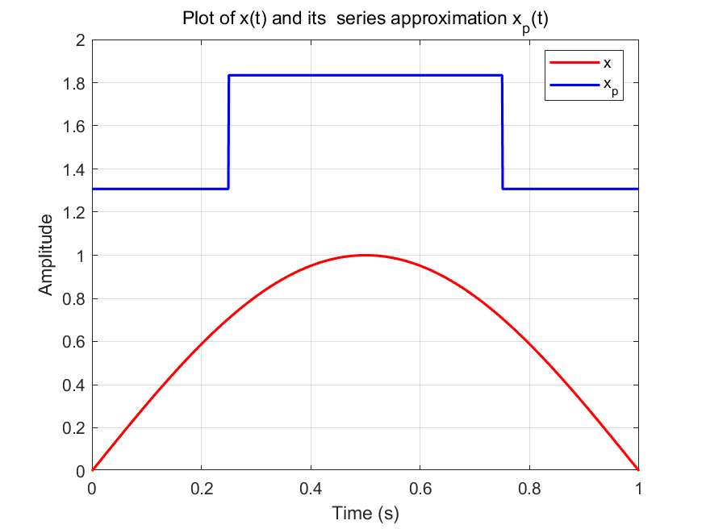
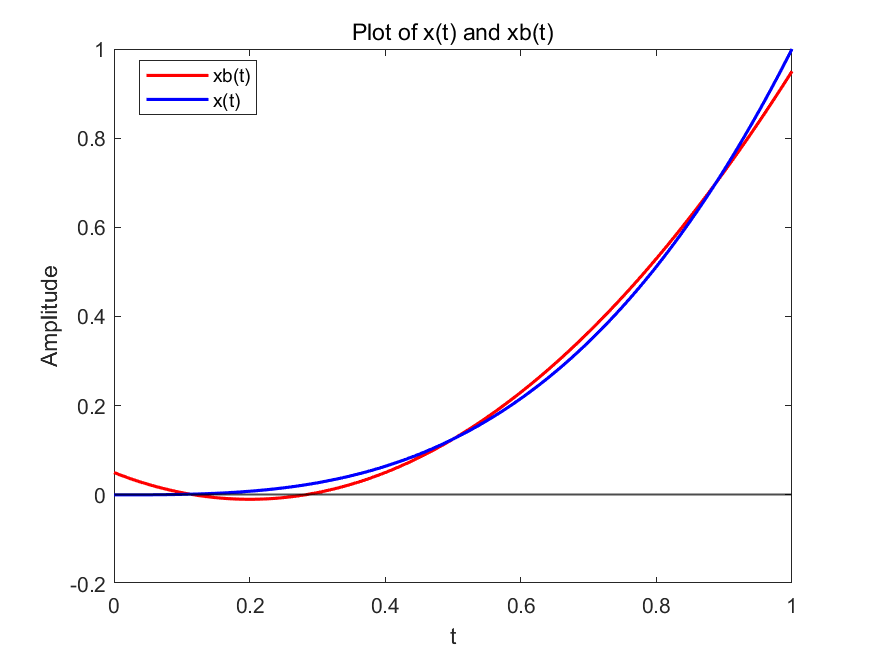
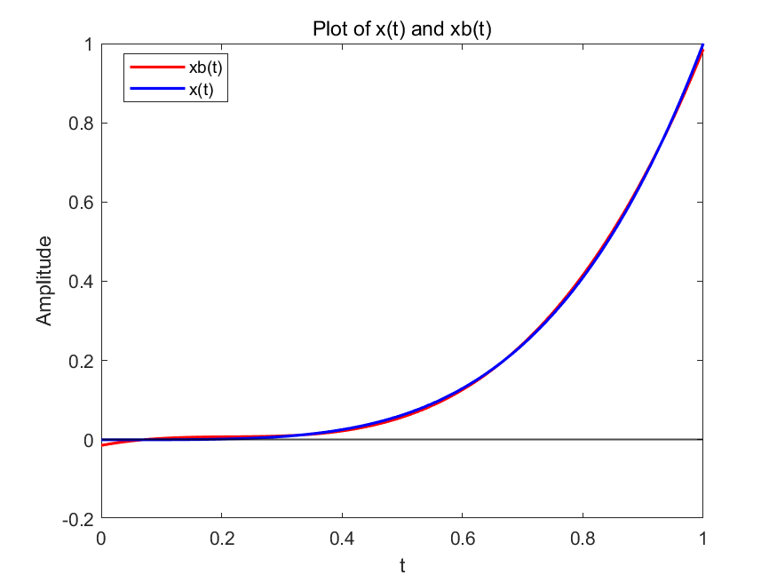
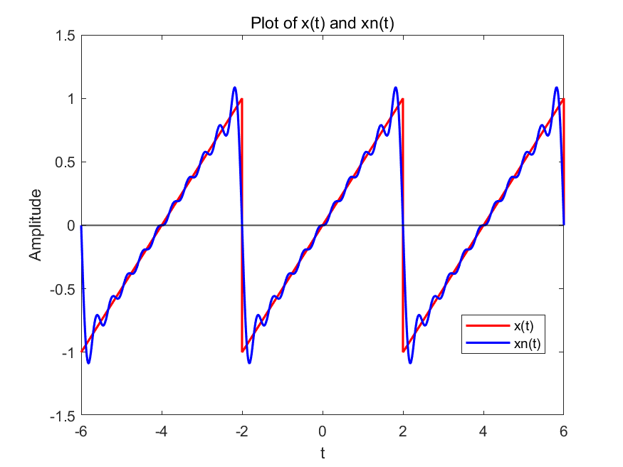
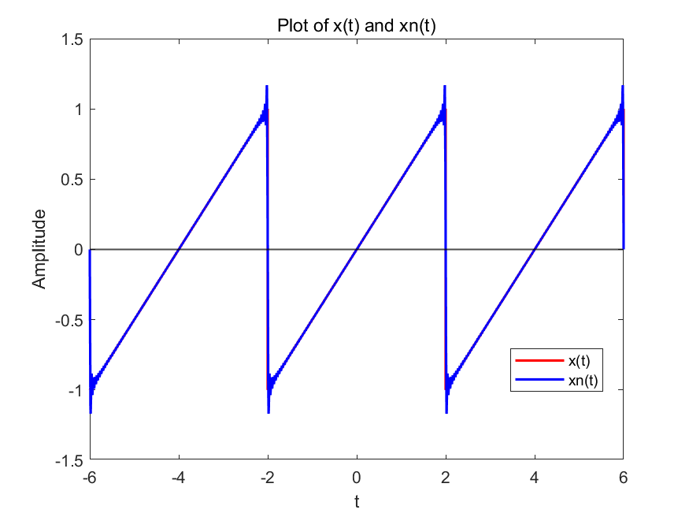
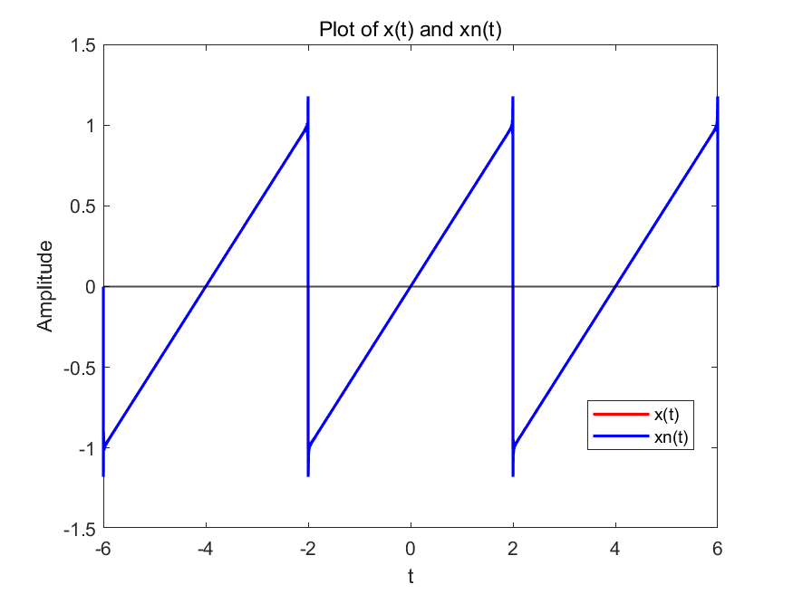

# 1(2)
请用MATAB在一张图上同时画出xt和a1φ1t+a2φ2t+a3φ3t+a4φ4t的函数图像，观察其区别。

图像如下所示，xp指使用哈尔小波拟合近似的信号，x指原信号：

代码如下：

```matlab
t = linspace(0,1,1000);
x = sin(pi*t);

phi1 = t>=0 & t<=1;

phi2 =(t>=0 & t<=0.5) + (-1)*(t>0.5 & t<=1);

phi3 = (t>=0 & t<=0.25) + (-1)*(t>0.25 & t<=0.5);

phi4 = (t>=0.5 & t<=0.75) + (-1)*(t>0.75 & t<=1);

x_p = 2\pi * phi1 + 0 * phi2 + (2-2*sqrt(2))/pi * phi3 + (-2+2*sqrt(2))/pi * phi4;
plot(t, x, 'r-', 'LineWidth', 1.5); hold on;
plot(t, x_p, 'b-', 'LineWidth', 1.5); hold off;

legend('x','x_p', 'Location', 'best');
xlabel('Time (s)');
ylabel('Amplitude');
title('Plot of x(t) and its  series approximation x_p(t)');
grid on;
saveas(gcf, 'problem1_2_plot.png');
```

# 3(3)
请用MATAB在一张图上同时画出xt和b1β1t+b2β2t+b3β3t+b4β4t的函数图像，观察其区别。

xb指幂级数拟合的信号，x指原信号，图像如下所示：


可以看到拟合效果非常好。

代码如下：

```matlab
t = linspace(0,1,1000);
x = t.^3;%produce a signal x(t) = t^3
beta1 = t>=0 & t<=1;

beta2 = t-0.5;

beta3 = t.^2 - t + 1/6;

xb=0.25*beta1 + 0.9*beta2 + 1.5*beta3;
plot(t,xb,'r',linewidth=1.5);
hold on;
plot(t,x,'b',linewidth=1.5);
yline(0, 'k-', 'LineWidth', 1);  % 黑色虚线，线宽1，标注x轴
legend('xb(t)','x(t)','Location','best');
xlabel('t');
ylabel('Amplitude');
title('Plot of x(t) and xb(t)');
saveas(gcf,'problem3_3.png');
hold off;
```

# 4(3)
请用MATAB在一张图上同时画出xt和a0P0t+a1P1t+a2P2t+a3P3t的函数图像，观察其区别。

xp指使用Legendre多项式拟合近似的信号，x指原信号，图像如下所示：


可以看到勒让德多项式可以对信号很好的近似。

```matlab
t = linspace(0,1,1000);
x = t.^4;%produce a signal x(t) = t^4
p0 = t>=0 & t<=1;% p0 = 1, 0<=t<=1; p0 = 0, otherwise

p1 = 2*t-1;

p2 = 6*t.^2 - 6*t + 1;

p3=20*t.^3 - 30*t.^2 + 12*t - 1;

xb=0.2*p0 + 0.4*p1 + (2/7)*p2 + 0.1*p3;

plot(t,xb,'r',linewidth=1.5);
hold on;
plot(t,x,'b',linewidth=1.5);
yline(0, 'k-', 'LineWidth', 1);  % 黑色虚线，线宽1，标注x轴
legend('xb(t)','x(t)','Location','best');
xlabel('t');
ylabel('Amplitude');
title('Plot of x(t) and xb(t)');
saveas(gcf,'problem4_3.png');
hold off;
```


# 6(3)
当E0=1, T0=4时，实现以上周期三角波的吉布斯现象。请编写MATLAB程序，画出
$x_N(t) = \frac{2E_0}{\pi} \sum_{k=1}^{N} \frac{(-1)^{k+1}}{k} \, \sin(k\omega_0 t)$
在N=10, 100, 1000时的图像，并与xt进行对比，观察吉布斯现象对信号图像的影响。

N=10时图像如下所示：

N=100时图像如下所示：

N=1000时图像如下所示：

可以看到随着N增加，xN(t)逐渐逼近xt，但在信号的跳变点附近会出现明显的过冲和振荡现象，吉布斯现象没有衰减。

```matlab
%matlab无法生成严格数学意义上的周期信号，在这里时间选择在[-1.5T, 1.5T]范围内，信号在这个范围内满足周期性条件，其他时间点的值为0
T =4;
E=1;
fs = 10000; % 采样频率 
t = 0:1/fs:3*T; % 生成时间向量，长度三个周期
t = t-1.5*T; % 平移，使得信号在[-1.5T, 1.5T]范围内
x = zeros(size(t)); % 线性函数，斜率为2E/T
for i=1:length(t)
    if(t(i)>=-1.5*T & t(i)<-0.5*T)
        x(i) = 2*E/T * (t(i)+T);
    elseif(t(i)>=0.5*T & t(i)<1.5*T)
        x(i) = 2*E/T * (t(i)-T);
    elseif(t(i)>=-0.5*T & t(i)<0.5*T)
        x(i) = 2*E/T * t(i);
    else
        x(i) = 0; % 其他时间点的值为0
    end
end

N = 1000;
omega = 2*pi/T; % 基频
xn = zeros(size(t)); % 初始化傅里叶级数近似
for k=1:N
    ak = (-1)^(k+1)/k; % 计算傅里叶系数
    xn = xn + ak*sin(k*omega*t); % 累加傅里叶级数近似
end
xn = xn * 2*E/pi;%系数在此处相乘可以减少计算量
plot(t,x,'r',linewidth=1.5);
hold on;
plot(t,xn,'b-',linewidth=1.5);
yline(0, 'k-', 'LineWidth', 1);  % 黑色虚线，线宽1，标注x轴
legend('x(t)','xn(t)','Location','best');
xlabel('t');
ylabel('Amplitude');
title('Plot of x(t) and xn(t)');
saveas(gcf,'problem6_3_when_N1000.png');
hold off;
```