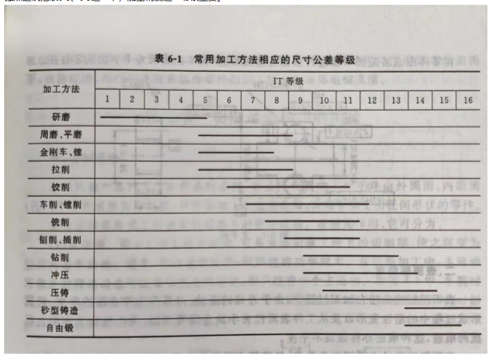
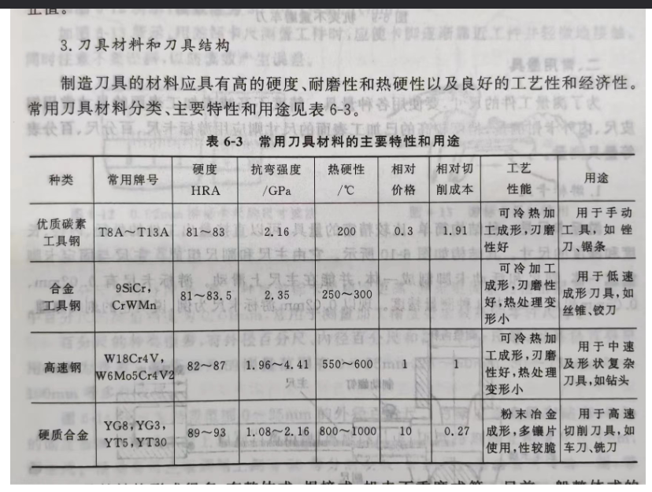

# 第二章 工程材料
## 2.1硬度和硬度
布氏硬度 淬火钢球 压痕面积大 数据重复性好但不能测试太硬的材料 
洛氏硬度 压痕小 适合于测量硬材料的硬度
维氏硬度 四方锥形金刚石 布氏硬度（HB）和维氏硬度（HV）也用于测量硬度，但洛氏硬度测试更为常用
肖氏硬度（HS）通常用于测量软材料的硬度
抵抗**塑性变形**`屈服强度`和**断裂**`抗拉强度`的==能力==
## 2.2金属材料
### 2.2.1常用金属材料包括含碳量<2.11%的碳素钢&合金钢，以及含碳量>2.11%的铸铁。
### 2.2.2用途
像08F钢、W18Cr4V钢是出了一道选择题去考是不是用这些材料去做什么种类的用途的。
### 2.2.3 碳素钢
硫、磷分别在高温低温时可以增加钢的脆性

碳钢
- 碳素结构钢
	45钢属于优质碳素结构钢。45钢具有价格便宜、切削加工性能好、淬火后硬度较高等特点，经过调质处理后，具有良好的强韧性和一定的耐磨性，因此被广泛应用于制造结构零件及中低档的塑料模具。
- 碳素工具钢
合金钢`是在碳素钢的基础上加入合金元素制成的钢`
- 合金结构钢
- 合金工具钢
- 特殊性能钢

铸铁
	抗拉强度、塑性、韧性都差
	但具有优良的耐磨性、减震性、铸造性能与切削加工性

| 类别  | 牌号        | 碳含量(%)    | 主要合金元素    | 性能特点       | 应用举例                    |
| --- | --------- | --------- | --------- | ---------- | ----------------------- |
| 碳素钢 | Q235      | ≤0.2      | 微量        | 良好的塑性和韧性   | 建筑结构、汽车制造、机械制造等轻负荷部件    |
|     | 45        | 0.42-0.50 | 微量        | 较高的强度和韧性   | 机械零件、工具、紧固件等            |
|     | T8        | 0.75-0.85 | 微量        | 较高的硬度和脆性   | 手工工具、木工工具等              |
|     | T12       | 1.0-1.1   | 微量        | 极高的硬度和脆性   | 高级手工工具、量具等              |
| 合金钢 | 40Cr      | 0.37-0.45 | Cr        | 良好的综合机械性能  | 汽车、航空、机械制造中的高强度部件       |
|     | 35CrMo    | 0.32-0.40 | Cr, Mo    | 高强度、耐疲劳性   | 高负荷机械零件、发动机曲轴等          |
|     | 9CrSi     | 0.85-0.95 | Si        | 高耐磨性、高硬度   | 弹簧、刀具、轴承等               |
| 铸铁  | HT200     | 2.7-3.1   | C         | 良好的铸造性和切削性 | 机床床身、发动机缸体等             |
|     | KTH330-08 | 3.1-3.4   | C, Si, Mn | 高强度、耐磨性    | 扳手、犁刀、传动链条阀门、船用电机壳、管接头等 |


08F钢和W18Cr4V钢是两种不同类型的钢材，具有不同的化学成分和性能，适用于不同的用途。

1. **08F钢**：
   - 08F钢是一种低碳钢，其碳含量约为0.08%。由于其低碳含量，08F钢具有良好的焊接性能和冷加工性能，同时具有较低的硬度和较高的韧性。
   - **用途**：08F钢常用于制造需要良好焊接性能和冷加工性能的部件，例如==汽车车身、容器、管道、电缆护套==等。由于其良好的塑性，它也适用于制造一些需要冷成型加工的部件。

2. **W18Cr4V钢**：
   - W18Cr4V钢是一种高速工具钢，属于钨系高速钢。其化学成分中含有较高比例的钨（W）、铬（Cr）和钒（V）。这种钢材具有极高的硬度、耐磨性和热稳定性。
   - **用途**：W18Cr4V钢主要用于制造高速切削工具，如==钻头、铣刀、拉刀、齿轮刀具==等。由于其优异的耐磨性和热稳定性，这种钢材非常适合用于高效率的金属切削加工，尤其是在高速和高温的工作条件下。

举例说明：

- **08F钢**：
  - 在汽车制造中，08F钢可以用于制造汽车的车身部件，如车门、引擎盖和后备箱盖，这些部件需要通过冷冲压成型，并且需要良好的焊接性能以便于与其他部件组装。

- **W18Cr4V钢**：
  - 在机械加工行业，W18Cr4V钢可以用于制造高精度的铣刀，这些铣刀在高速旋转下进行金属切削，需要极高的耐磨性和热稳定性以保持切削性能和延长刀具寿命。

这两种钢材因其独特的性能特点，在各自的应用领域内发挥着重要作用。

## 2.3非金属材料
非金属材料主要掌握塑料（按照应用可分为工程塑料，通用塑料和耐热塑料）和陶瓷。
### 2.3.1陶瓷
普通陶瓷 天然硅酸盐材料
特种陶瓷 高熔点的碳化物、氧化物、氮化物、硅化物等的烧结产物
金属陶瓷 指的是用陶瓷的生产方法制取的金属与碳化物或其它化合物的粉末制品
### 2.3.2麻花钻使用的金属材料是高速钢
麻花钻头通常由高速钢（High-Speed Steel，简称HSS）制成。高速钢是一种含有钨、钼、铬、钒等合金元素的工具钢，具有很高的硬度、耐磨性和红硬性（即在高温下保持硬度的能力）。这些特性使得高速钢成为制造麻花钻头的理想材料，因为麻花钻头在钻孔过程中需要承受高压力和摩擦力，同时还要保持锋利的切削刃。

高速钢麻花钻头适用于加工各种金属材料，包括碳钢、合金钢、不锈钢、铜、铝等。它们可以用于手动钻孔或在钻床、铣床、车床等机床上进行钻孔操作。

除了高速钢，还有其他类型的材料也用于制造钻头，例如：

1. **硬质合金**：硬质合金钻头由碳化钨（WC）和钴（Co）等硬质材料制成，具有更高的硬度和耐磨性，适用于加工硬度较高的材料，如硬化钢、钛合金等。

2. **陶瓷**：陶瓷钻头具有极高的硬度和耐热性，适用于高速钻孔和加工高温合金。

3. **金刚石**：金刚石钻头由天然或人造金刚石制成，具有最高的硬度和耐磨性，适用于加工非金属材料，如玻璃、陶瓷、石材等。

4. **涂层钻头**：为了提高钻头的性能，一些钻头会在高速钢或硬质合金基体上涂覆一层或多层耐磨材料，如TiN（氮化钛）、TiCN（碳氮化钛）、AlTiN（铝钛氮）等。

选择合适的钻头材料取决于被加工材料的类型、加工条件和所需的加工效果。
##  2.3.热处理 
### 2.3.1热处理的基本工艺做法和用处
热处理的基本工艺方法包括退火、正火、淬火和回火。
热处理是通过加热、保温和冷却等手段，改变金属材料内部组织结构，以获得所需性能的工艺过程。热处理的基本工艺方法包括：

1. **退火**：将金属加热到适当温度，保温一段时间后**缓慢冷却**，目的是**消除应力**、细化晶粒、==降低硬度、提高塑性和韧性。==

2. **正火**：将金属加热到适当温度，保温一段时间后**在空气中冷却**，目的是改善材料的==切削性能和机械性能。==正火也可以是为**淬火**做准备
3. **淬火**：将金属加热到适当温度，保温一段时间后**迅速冷却**，目的是提高硬度和强度，但会==增加脆性==。
冷却时应当使得==冷却速度大于临界冷却速度==，才能获得马氏体组织
在这个前提下应当==尽量缓慢冷却==，减少内应力，防止变形和开裂。
4. **回火**：==淬火==后的金属**重新加热**到低于临界温度，保温一段时间后冷却，目的是降低硬度和脆性，==提高韧性，稳定组织。==
	1. 低温回火150-250℃ 高硬度（58-64HRC），耐磨性 **刀具、量具**
	2. 中温回火350-500°C 高弹性极限、强度、韧性、中等硬度（38-50HRC）： **弹簧**
	3. 高温回火500°C以上 消除内应力，保持强度与硬度的同时，也具有较好的韧性与塑性
		`通常将钢件淬火以及高温回火的复合热处理成为调质处理`主要应用于重要结构零件，如**轴、齿轮、连杆**等
### 2.3.2马氏体。
马氏体是通过**淬火**得到的一种硬而脆的组织，其硬度通常很高，硬度值通常用HRC（洛氏硬度）表示。淬火后的马氏体硬度一般在HRC 50以上，具体硬度值取决于材料的成分和淬火条件。

### 2.3.3硬度HRC 
### 2.3.4 熔炼 
铸铁——冲天炉； 
铸钢——电弧炉； 
有色金属——坩埚炉
### 2.3.5 表面热处理
表面热处理是通过改变材料表面的化学成分和组织结构来提高表面硬度、耐磨性、抗疲劳性和耐腐蚀性的热处理方法。常见的表面热处理方法包括：

- **渗碳**：增加表面碳含量，提高表面硬度和耐磨性。
- **氮化**：增加表面氮含量，提高表面硬度和耐磨性。
- **感应淬火**：通过感应电流快速加热表面，然后迅速冷却，提高表面硬度。
# 第三章 铸造
## 3.1铸造优劣
铸造的优点是**成本低、复杂空腔、适应性强**，缺陷是力学性能不如锻件高、晶粒粗大、气孔、夹渣、砂眼等。 
## 3.2型砂的**五大性能要求和组成**
## 3.3**五个铸造工艺**（尤其注意起模斜度和铸造圆角）
## 3.4浇注温度低会产生**浇不足、冷隔和气孔**，温度高会导致**缩孔、裂纹、晶粒粗大和黏砂。**
## 3.5浇注系统的**外浇口、直浇道、横浇道、内浇道**和**冒口**
### 外浇口
- 分为漏斗形（小）盆形（大）
- 缓冲，分离熔渣
### 直浇道
- 连接外浇口与横浇道
- 利用高度差产生静压力
### 横浇道
- 连接直浇道和横浇道
- 挡渣
### 内浇道
- 直接和型腔相连接的通道
- 控制金属液的位置、速度、方向
## 3.6浇注速度的后果
浇注温度偏低，金属液流动性差，易产生浇不足、
冷隔、气孔等缺陷；浇注温度过高，铸件收缩大，易产生缩孔、
裂纹、晶粒粗大及粘砂等缺陷。合适的浇注温度应根据铸造合金
种类、铸件的大小及形状等确定。
# 第四章压力加工
## 6.锻压
自由锻和模锻 冲压

# 第五章 焊接
电弧焊的焊机分为DC和AC。AC==简单便宜但电弧不太稳定==，DC稳定但复杂昂贵。

直流焊接的接线法，主要看**焊件接的**是正极还是负极，前者称为正接，适用于黑色金属和厚板；后者称为反接，适用于有色金属和薄板。

- 碱性焊条应该采用**直流反接**。`可以保证电流燃烧稳定`
- 对接受力均匀，是应用最多的街头形式

焊条=焊芯+药皮，药皮考了一道选择题。酸性氧化物组成的药皮就是酸性焊条，反之就是碱性焊条。前者DC/AC都能用，但容易断；**后者只能用DC，但力学性能好，适用于中、高碳钢的焊接**。 

被焊工件厚度、焊接质量→焊条直径→焊接电流
焊条直径、焊接电流、焊接速度和空间位置
## 5.1各种焊接
### 5.1.1气焊
气焊通过乙炔和氧气来焊接厚度在3mm以下的低碳钢薄板、高碳钢、铸铁和有色金属及合金。其中C2H2/O2比例不同分为3种火焰，碳化焰对本身含碳量比较高的母材有**增碳作用**，要搭配起来。
焊接厚度比较低
电弧焊相比，焊接质量差，但胜在方便

- 在实操调整时，如果要减小火焰，先减少氧气、要增大火焰，先增加乙炔

|              | 中性焰       | 碳化焰         | 氧化焰  |
| ------------ | --------- | ----------- | ---- |
| $O_2/C_2H_2$ | 1.0-1.2   | <1.0        | >1.2 |
| 火焰特性         |           | 还原性         | 氧化性  |
| 适用金属         | 低、中碳钢、合金钢 | 高碳钢、铸铁、硬质合金 | 黄铜   |
### 5.1.2气割 
气割是直接把母材烧掉来实现金属切割，需要注意被割材料的要求。 
氧气切割主要用于**切割碳钢和低合金钢**等易于氧化的金属材料。对于不锈钢、铝、铜等不易氧化的金属材料，氧气切割则不适用，因为这些材料在高温下不易形成氧化物，或者形成的氧化物熔点很高，不易被切割。

要求：
- 被切割金属燃点应当低于用作切割的金属燃点
- 燃烧生成的氧化物燃点应当低于被切割金属燃点
- 金属燃烧可以产生大量的热，并且金属导热性地
### 5.1.3电阻焊
电阻焊就是压力焊，需要注意电焊、缝焊与对焊各自的适用条件，如电焊要求4mm以下薄板，缝焊要求3mm以下密封容器等。 
点焊：薄板结构
缝焊：连续点焊，要求比点焊还薄，用于密封管道和容器
对焊：强度要求不高，直径不能太大
### 5.1.4钎焊
分为硬钎焊和软钎焊，可以连接==异种金属==，甚至金属和非金属。硬钎焊的钎料熔点高（分界点：450℃），一般用Cu/Ag，应用于刀具焊接；软钎焊钎料熔点低，用Sn，应用于**电子元件**和线路。

# 第六章 切削加工


切削运动中，主运动就是转动，进给运动就是轴向运动。
切削用量的**三个要素**包括切削速度（刀在工件上所留下痕迹的速度）、进给量（刀片本身的走刀量）和背吃刀量（吃刀深度），
- **粗加工**首先需要考虑**背吃刀量**，**精加工**影响最大的则是**切削速度**
- 对刀具耐用度影响程度切削速度>进给量>背吃刀量

切削工具中，车刀、刨刀属于单刃刀具，钻头、铣刀属于多刃刀具
车刀的如下几个参数非常重要： 
- 前角大`前刀面与正交面的夹角`精加工，刀具锋利，但刀刃强度降低； 
- 后角大精加工，减小摩擦； 
- 主偏角大（趋向垂直）能够减小振动、改善切削条件，但是刀具散热变差； 
- ==副偏角大能减小摩擦，但表面粗糙度增大==； 
- 刃倾角正精加工，切屑流向待加工表面；
- 刃倾角负粗加工，切屑流向已加工表面，且刀体强度高；

通常，制作车刀时并没有预先制出前角（γ0） ，而是靠在车刀上刃磨出排屑槽来获得前角的。排屑槽也叫断屑槽，它可以：折断切屑，不产生缠绕；控制切屑的流出方向，保持已加工表面的精度；降低切削抗力，延长刀具寿命。

# 第七章 车削加工（主要是普车） 
普车构成，
用丝杠来车螺纹，不知道那个螺距具体是看丝杠的还是和工件的比例。
- 车圆锥 实习的时候使用的是转动小拖板法
传动系统 
三爪卡盘==自动==定心==精度低==，四爪卡盘==不能自动定心夹紧====力大精度高==。 
顶尖、花盘、心轴、中心架
## 7.1 车端面
1.车刀刀尖应对准工件中心，否则将在端面中心处车出凸台，并易蹦坏刀尖。
2.车端面时，切削速度由外向中心逐渐减少，会影响端面的粗糙度，因此，工件速度应比车外圆略高。用45°右偏刀车端面时， 由外向中心车削时，凸台是瞬间车掉，易产生振动，损坏刀具， 因此，切削接近中心时，应放慢进给速度。对于有孔的工件，车 端面时，常用右偏刀由中心向外进给，这样切削厚度较小，刀刃 有前角，因而切削顺利，粗糙度较小。 
3.车削直径较大的端面时，为避免因车刀受刀架移动产生凸出或 凹进，可将拖板固定在床身上进行横向切削，背吃刀量用小刀架 调节
## 7.2 车外圆
粗加工
	使用外圆粗车刀，要求吃刀深，走刀快
	前角小、后角小、主偏角小但不能太小
	车外圆、、孔加工、车圆锥都有涉及，但主要是在和车圆锥上。
偏移尾座法没法车内圆锥面（锥孔） 
# 第八章 钻削、铣削和磨削 
## 8.1砂轮硬度是指什么
砂轮的硬度是指在外力作用下磨粒脱落的难易程度。易脱落的称
之为软，反之为硬。磨削软材料时选用硬砂轮，磨削硬材料时则
选用软砂轮。粗磨选用软砂轮，精磨选用硬砂轮。
### 8.1.1砂轮硬度的分类

砂轮硬度通常分为以下几类：

1. **软砂轮**：磨料颗粒容易从砂轮表面脱落，适合于磨削软材料或需要大量磨料参与切削的场合。

2. **中等硬度砂轮**：磨料颗粒的脱落速度适中，适合于大多数常规磨削作业。

3. **硬砂轮**：磨料颗粒不易脱落，适合于磨削硬材料或需要保持砂轮形状稳定性的场合。

### 8.1.2砂轮硬度的影响因素

砂轮的硬度受以下因素影响：

- **结合剂类型**：结合剂是将磨料颗粒固定在砂轮上的材料，如树脂、陶瓷、橡胶等。不同类型的结合剂具有不同的硬度和强度。

- **磨料颗粒的固定程度**：磨料颗粒与结合剂的结合强度越高，砂轮硬度越高。

- **磨料颗粒的粒度**：粒度越细的磨料颗粒，其固定在砂轮上的难度越大，因此细粒度的砂轮通常硬度较低。

### 8.1.3砂轮硬度的选择

选择合适的砂轮硬度对于磨削加工至关重要，它直接影响到磨削效率、工件表面质量以及砂轮的使用寿命。以下是一些选择砂轮硬度的指导原则：

- **工件材料硬度**：加工硬材料时，应选择硬度较高的砂轮；加工软材料时，应选择硬度较低的砂轮。

- **磨削条件**：磨削深度大、磨削力强时，应选择硬度较高的砂轮；磨削深度小、磨削力弱时，可选择硬度较低的砂轮。

- **磨削效率和表面质量**：需要高磨削效率时，可选择硬度较高的砂轮；需要高表面质量时，应选择硬度适中的砂轮。

- **砂轮的磨损情况**：砂轮磨损快时，可能需要选择硬度较高的砂轮；磨损慢时，可选择硬度较低的砂轮。

正确选择砂轮硬度，结合适当的磨削参数，可以有效提高磨削加工的效率和质量。在实际应用中，应根据具体的加工要求和工件材料特性，选择最合适的砂轮硬度。
## 8.2 铣床的主要附件（平口钳、回转工作台、万能立铣头、万能分度头）不包括哪个
万能立铣头
## 8.3 高速铣削相对普通铣削的优势
切削热少，加工精度高
## 8.4 磨削

# 第九章 钳工
## 9.1 划线
划线到底正不正式、又大又不规则的工件用什么支承工具（千斤顶）等。
## 9.2 錾削
錾削是一种传统的金属加工技术，属于手工锻造工艺的一部分。它主要通过使用錾子（一种带有锋利刃口的工具）和锤子来对金属进行加工，以去除多余的金属、修整形状或进行表面处理。錾削通常在**金属加热到一定温度后进行**，这样可以降低金属的硬度，使其更容易被錾子切割。

錾削的主要步骤包括：

1. **加热金属**：将需要加工的金属工件加热到适当的温度，通常在锻造温度范围内，以便于錾削。

2. **定位和固定**：将加热后的金属工件放置在工作台上，并使用夹具或固定装置将其固定，以确保在錾削过程中工件不会移动。

3. **使用錾子和锤子**：操作者使用锤子敲击錾子的柄部，利用錾子的刃口对金属进行切割或修整。錾削时，操作者需要根据需要加工的形状和尺寸，调整錾子的角度和位置。

4. **去除多余金属**：通过錾削，可以去除金属表面的多余部分，或者对金属表面进行修整，以达到所需的形状和尺寸。

5. **冷却和后续处理**：錾削完成后，工件需要冷却。根据需要，可能还需要进行后续的热处理、打磨或抛光等处理。

錾削是一种非常灵活的加工方法，适用于小批量生产或对精度要求不高的场合。它能够实现对金属的精细加工，但效率相对较低，且需要操作者具有一定的技能和经验。随着现代机械加工技术的发展，錾削在工业生产中的应用已经逐渐减少，但在一些特定的金属工艺和艺术加工领域，如金属雕塑、传统工艺制作等，錾削仍然是一种重要的加工手段。
## 9.3 锯削
锯削非常经典。软厚用粗齿、硬薄用细齿，还是10~15的起锯角，往返长度不超过2/3，都在选项中出现过。
## 9.4 锉削
## 9.5 交叉锉
 交叉锉（Cross Cut File）是一种具有交叉排列的锉齿的锉刀，它在金属加工和木工中被广泛使用。这种锉刀的设计使得它在两个方向上都能有效地去除材料，因此得名“交叉锉”。交叉锉的齿形设计使其在横向和纵向都能进行锉削，非常适合于去除金属表面的毛刺、平整表面或进行精细的锉削工作。

### 交叉锉的特点：

1. **齿形排列**：交叉锉的齿形是交叉排列的，这种排列方式使得锉刀在两个方向上都能有效地去除材料。这种设计使得交叉锉在进行横向和纵向锉削时都能保持良好的切削性能。

2. **齿形角度**：交叉锉的齿形角度通常设计为45度或60度，这种角度有助于提高锉削效率，同时减少材料的粘附。

3. **齿形深度**：齿形的深度决定了锉刀的切削能力。较深的齿形适合于去除大量材料，而较浅的齿形则适合于精细的锉削工作。

4. **齿形密度**：齿形的密度决定了锉刀的切削速度和表面粗糙度。齿形密度越高，锉削速度越快，但表面可能越粗糙；齿形密度越低，锉削速度越慢，但表面越光滑。

### 交叉锉的应用：

1. **金属加工**：在金属加工中，交叉锉用于去除金属表面的毛刺、平整表面或进行精细的锉削工作。它特别适合于需要在两个方向上进行锉削的场合。

2. **木工**：在木工领域，交叉锉可以用于去除木材表面的毛刺、平整木材表面或进行精细的锉削工作。它特别适合于需要在两个方向上进行锉削的场合。

3. **模型制作**：在模型制作和手工艺品制作中，交叉锉可以用于精细的锉削工作，以达到所需的形状和尺寸。

4. **工具维护**：交叉锉还可以用于维护和修理工具，如去除工具上的锈迹、平整工具表面或进行精细的锉削工作。

交叉锉是一种非常实用的工具，它在多个领域都有广泛的应用。选择合适的交叉锉时，需要考虑齿形角度、齿形深度和齿形密度等因素，以确保它能够满足特定的加工需求。

## 9.6 **攻丝和套丝**
## 9.7 丝锥、板牙
## 9.8 车床的主轴箱属于部件装配
## 9.9 CAD包括装配设计
# 第十章 数车
代码
在数控编程中，G、S、M、T是数控机床编程中常用的指令代码，它们分别代表不同的功能和操作：

### G代码（准备功能）

G代码用于指定机床的运动模式和操作方式。它们告诉机床执行特定的运动或操作，如直线插补、圆弧插补、快速定位等。G代码是数控编程中最基本的指令之一，通常分为G00到G99的范围。

- **G00**：快速定位，用于快速移动刀具到指定位置。
- **G01**：直线插补，用于以恒定速度沿直线路径移动刀具。
- **G02**：顺时针圆弧插补，用于沿顺时针方向进行圆弧运动。
- **G03**：逆时针圆弧插补，用于沿逆时针方向进行圆弧运动。
- **G28**：返回参考点，用于将刀具移动到机床的参考点。
- **G90**：绝对编程，表示后续的坐标值是相对于原点的绝对位置。
- **G91**：增量编程，表示后续的坐标值是相对于当前位置的增量。

### S代码（主轴速度）

S代码用于设定主轴的转速。它通常与M代码一起使用，以控制主轴的启动和停止。S代码后面通常跟随一个数值，表示主轴的转速（单位为转/分钟）。

- **S1000**：设定主轴转速为1000转/分钟。

### M代码（辅助功能）

M代码用于控制机床的辅助功能，如主轴的启动和停止、冷却液的开关、刀具的更换等。M代码后面通常跟随一个数值或字母，表示特定的辅助功能。

- **M03**：主轴正转。
- **M04**：主轴反转。
- **M05**：主轴停止。
- **M06**：刀具更换。
- **M08**：冷却液开启。
- **M09**：冷却液关闭。

### T代码（刀具选择）

T代码用于选择和激活特定的刀具。在数控机床上，每把刀具都有一个唯一的编号，T代码后面跟随的数值即为刀具的编号。

- **T01**：选择刀具号为01的刀具。
- T1D1

### F代码（进给率）

在实际编程中，G、S、M、T代码通常会组合使用，以实现复杂的加工任务。例如，一个典型的数控程序行可能包含G代码、S代码、M代码和T代码，如：

```
G00 X0 Y0 Z0 S1500 M03 T01
```

这行代码表示快速移动刀具到原点（X0, Y0, Z0），设置主轴转速为1500转/分钟，启动主轴正转，并选择刀具号为01。

# 第十一章 特种加工
## 11.1
电火花只能加工导电材料（半导体也算）
## 11.2 电子束、离子束和超声波能不能加工金属材料的问题

是的，电子束、离子束和超声波都可以用来加工金属材料，每种方法都有其独特的应用和优势。

### 电子束加工

电子束加工是一种利用高能电子束对材料进行加工的技术。电子束可以聚焦成非常小的点，因此具有很高的能量密度。电子束加工通常用于以下方面：

- **电子束焊接**：通过高能电子束的热效应，可以实现金属材料的精确焊接，尤其适用于难以焊接的材料或精密部件。
- **电子束切割**：电子束可以用来切割金属材料，尤其适合于切割厚板或复杂形状的零件。
- **表面改性**：通过电子束照射，可以改变金属表面的微观结构，提高其耐磨性、耐腐蚀性等性能。

### 离子束加工

离子束加工是一种利用高能离子束对材料进行加工的技术。离子束加工可以分为离子束刻蚀和离子束注入两种主要方式：

- **离子束刻蚀**：通过离子束的物理撞击作用，可以去除材料表面的原子，实现精细的表面加工或图案化。
- **离子束注入**：通过将离子注入到材料表面，可以改变材料表面的化学成分和微观结构，从而改善材料的性能。

离子束加工特别适合于半导体材料的加工，以及在材料表面形成特定的化学和物理性质。

### 超声波加工

超声波加工是一种利用超声波振动能量对材料进行加工的技术。超声波加工通常用于以下方面：

- **超声波切割**：利用超声波振动的刀具进行切割，适用于切割硬质材料，如玻璃、陶瓷、硬质合金等。
- **超声波钻孔**：通过超声波振动的钻头进行钻孔，适用于加工小孔或深孔。
- **超声波抛光**：利用超声波振动的工具进行抛光，可以提高工件表面的光洁度。

超声波加工的特点是加工过程温和，不会产生大量的热量，适合于精密加工和对热敏感材料的加工。

每种加工方法都有其特定的应用场景和限制，选择合适的加工方法需要根据加工材料的性质、加工精度要求以及加工成本等因素综合考虑。
## 11.3 电解加工
电解加工（Electrochemical Machining, ECM）是一种利用**电化学反应去除材料**的非传统加工方法。它适用于加工各种==导电材料==，尤其是那些难以通过传统机械加工方法加工的材料。
### 11.3.1电解加工适合的材料：

1. **硬质材料**：如硬质合金、不锈钢、钛合金等，这些材料硬度高，机械加工困难，但电解加工可以有效去除。

2. **高熔点材料**：如钨、钼等，这些材料的熔点非常高，传统加工方法难以加工，而电解加工不受材料熔点的限制。

3. **复杂形状零件**：对于具有复杂形状和内腔的零件，电解加工可以实现无接触加工，避免了传统机械加工中刀具难以进入的问题。

4. **高精度要求零件**：电解加工可以实现高精度的尺寸控制和表面光洁度，适用于精密零件的加工。

5. **易碎材料**：如玻璃、陶瓷等，这些材料在机械加工时容易碎裂，而电解加工可以避免这种问题。

电解加工的基本原理是利用电解液中的离子在电场作用下移动，当工件作为阳极时，工件表面的金属离子会溶解进入电解液中，从而实现材料的去除。
### 11.3.2电解加工的优点包括：
- **无机械应力**：由于加工过程中没有机械力作用，因此不会产生机械应力，适合加工易碎或易变形的材料。
- **加工速度快**：电解加工的去除率高，适合于大批量生产。
- **表面质量好**：加工表面光洁度高，不需要后续抛光处理。
- **加工精度高**：可以实现高精度的尺寸控制。

### 11.3.3电解加工的局限性
需要使用导电的电解液，对环境有一定的污染风险
加工过程中会产生氢气，需要采取安全措施
对操作人员的专业技能要求较高
因此，在选择电解加工时，需要综合考虑材料的性质、加工要求以及成本等因素。
## 11.4 激光加工
激光加工可以加工深而窄的小缝微孔，而且可以切割很多金属和非金属。

# 第十二章 3D打印和cad/cam
3D打印 3D打印=快速成型=增材制造。 
光固法的精度最高。 